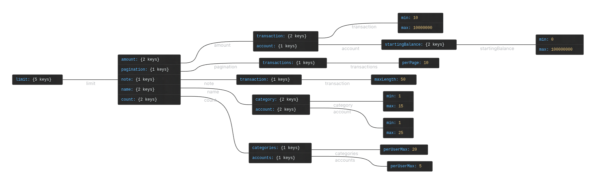

# Library

This directory lives outside both `src/` and `convex/` intentionally.

## Why not inside `src/`?

Convex backend functions (in `convex/`) run on Convex's cloud servers, they cannot import from `src/`. Placing shared constants inside `src/` would force us to duplicate them in `convex/`, leading to values drifting out of sync.

## Structure

```
.
├── convex/       ← backend (Convex cloud)
├── src/          ← frontend (Next.js / React)
└── lib/          ← shared code, framework-agnostic
    └── constants/
        └── constraints.ts
```

Both `convex/` and `src/` can import from `lib/` without any duplication.

## Rules for files in this directory

To keep imports working from both sides, files here must be **pure TypeScript** — no browser APIs, no Node.js built-ins, no framework-specific imports (e.g. no React, no Next.js, no Convex helpers). Just values and types.

## Constraints map

The constraints tree diagram is generated with [Json Crack](https://jsoncrack.com/editor) and lives at:

```
doc/src/constraint-tree.png
```


