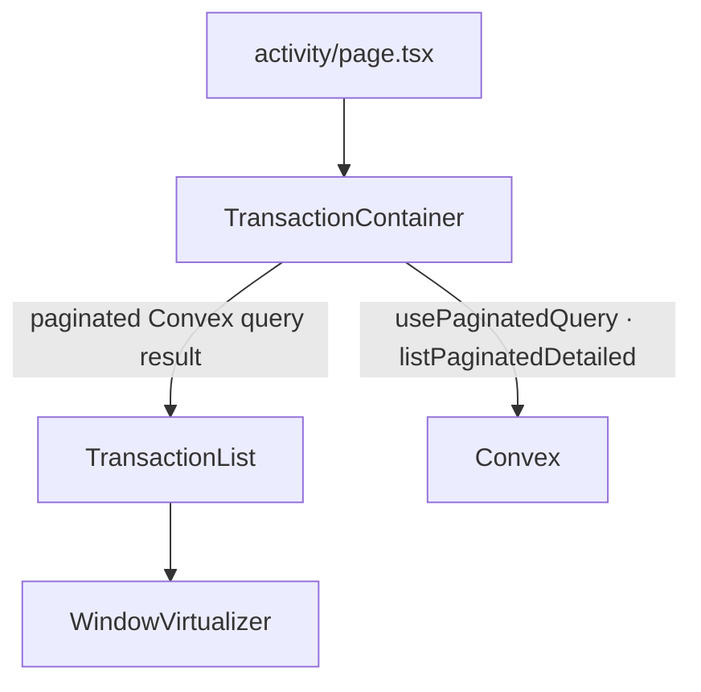
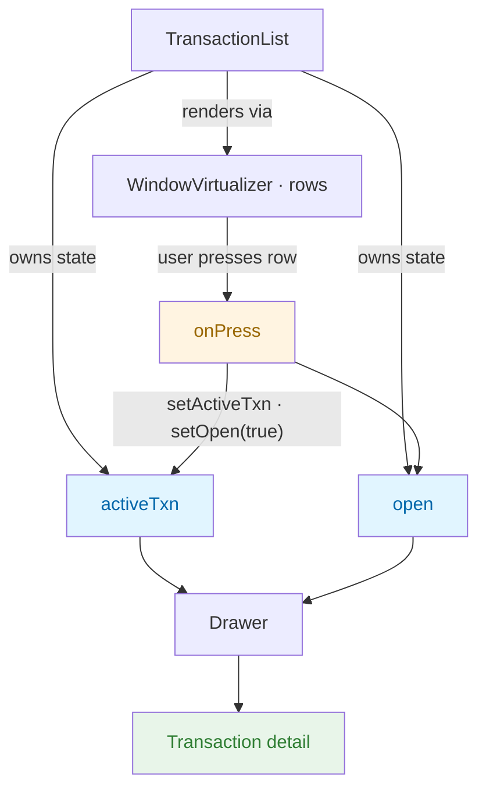

# Activity transactions UI

## Component hierarchy

| Component                  | Role                                                                                                                                                                                                                                                                                                                      |
| -------------------------- | ------------------------------------------------------------------------------------------------------------------------------------------------------------------------------------------------------------------------------------------------------------------------------------------------------------------------- |
| **`TransactionContainer`** | Client boundary. Calls Convex via `usePaginatedQuery` (`api.transaction.listPaginatedDetailed`). Shows a spinner until the first page is ready, then passes the **entire** paginated handle to `TransactionList`.                                                                                                         |
| **`TransactionList`**      | Receives `results`, `loadMore`, `isLoading`, and `status` from that handle. Groups rows by date (`createCollection` + `flattenCollection`), renders them with **`WindowVirtualizer`**, and wires **infinite scroll** so more pages load as the user scrolls toward the end. Also owns drawer state (`activeTxn`, `open`). |
| **`WindowVirtualizer`**    | Shared UI primitive (`@/components/ui/virtualizer/window-virtualizer`). Uses `@tanstack/react-virtual`’s **window** virtualizer, optional **section headers**, and an **infinite** mode that appends a loader row and calls `onLoadMore` when the viewport nears the end.                                                 |

## Data flow (Convex → list → virtualizer)

1. **`TransactionContainer`** runs `usePaginatedQuery` with `initialNumItems` from `limit.pagination.transactions.perPage`.
2. While `status === "LoadingFirstPage"`, only a loading spinner is shown.
3. **`TransactionList`** gets the full return value as a prop named `transactions` and passes the relevant fields into `WindowVirtualizer`:
   - **`infinite.hasMore`** — `status === "CanLoadMore"`
   - **`infinite.isLoading`** — Convex `isLoading` while fetching the next page
   - **`infinite.onLoadMore`** — `loadMore(limit.pagination.transactions.perPage)`
   - **`infinite.renderLoader`** — inline loader row at the end of the virtual list
4. When the user scrolls so the last virtualized row is near the end, **`WindowVirtualizer`** triggers `loadMore`, Convex appends the next page, and the flattened list grows.

`ListEndMessage` is shown when `status === "Exhausted"` (no more pages).

---

# Drawer / row selection

## State in `TransactionList`

| State       | Type                      | Purpose              |
| ----------- | ------------------------- | -------------------- |
| `activeTxn` | transaction row or `null` | Selected transaction |
| `open`      | `boolean`                 | Drawer visibility    |

Row press uses `startTransition` when opening the drawer.

## Why props instead of context?

The API isn’t finalized yet. Lifting drawer state in `TransactionList` and passing props keeps things explicit — no `Drawer.Provider`, easy to refactor once the API is settled.
