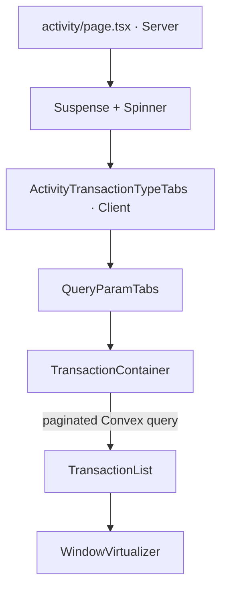
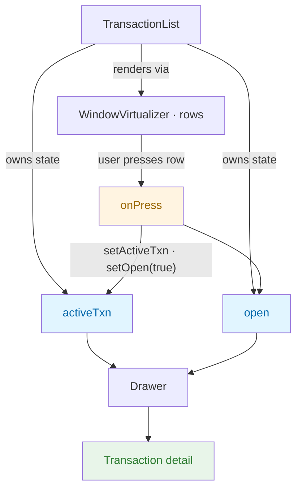

# Activity transactions UI

The Activity route combines a **URL-driven filter tab bar** (All / Expense / Income) with an **infinite, virtualized transaction list** backed by Convex.

---

## Component hierarchy

| Component                         | Role                                                                                                                                                                                                                                    |
| --------------------------------- | --------------------------------------------------------------------------------------------------------------------------------------------------------------------------------------------------------------------------------------- | --------------------------------------------------------------------------------------------------------------------------------------------------------------- |
| **`page.tsx`**                    | Server Component: `sr-only` page title, `Container`, **`Suspense`** around the client subtree that calls `useSearchParams` (required by [Next.js](https://nextjs.org/docs/app/api-reference/functions/use-search-params)).              |
| **`ActivityTransactionTypeTabs`** | Feature wrapper: defines `type` query tabs (All omits `type`; Expense/Income set `type=expense                                                                                                                                          | income`), calls **`useQueryParamTabSelection`** with `defaultAliases: ["*"]`, renders **`QueryParamTabs`** and passes **`TransactionContainer`\*\* as children. |
| **`QueryParamTabs`**              | Generic UI from [`@/components/navigation/query-param-tabs`](../../components/navigation/query-param-tabs/README.md) — presentation only; `selectedKey` comes from the hook.                                                            |
| **`TransactionContainer`**        | Client boundary: reads `type` via `useSearchParams`, **`parseTransactionTypeParam`** ([`transaction-type-filter.ts`](../transaction-type-filter.ts)), passes args to **`usePaginatedQuery`** (`api.transaction.listPaginatedDetailed`). |
| **`TransactionList`**             | Groups rows by date, **`WindowVirtualizer`**, infinite scroll, drawer state.                                                                                                                                                            |
| **`WindowVirtualizer`**           | Shared primitive (`@/components/ui/virtualizer/window-virtualizer`).                                                                                                                                                                    |

---

## URL filter vs Convex args

| Concern                      | Mechanism                                                                                                                                                                                                                                                            |
| ---------------------------- | -------------------------------------------------------------------------------------------------------------------------------------------------------------------------------------------------------------------------------------------------------------------- |
| **Which tab is highlighted** | `useQueryParamTabSelection("type", ITEMS, { defaultAliases: ["*"] })` — same rules as [`resolveQueryParamTabId`](../../components/navigation/query-param-tabs/README.md#resolvequeryparamtabid): missing/empty/`*` → “All” tab; `expense` / `income` → matching tab. |
| **What the list queries**    | **`parseTransactionTypeParam(searchParams.get("type"))`** → logical `TransactionTypeParam`: `"*"` means no Convex `type` filter; `"expense"` / `"income"` maps to `{ type }` on `listPaginatedDetailed`.                                                             |

Keep these two in step when you change tab items or URL semantics: **tab selection** uses the generic resolver; **data** uses the activity-specific parser next to this route.

---

## Data flow (Convex → list → virtualizer)

1. **`TransactionContainer`** runs `usePaginatedQuery` with `initialNumItems` from `limit.pagination.transactions.perPage` and query args derived from **`parseTransactionTypeParam`** (`{}` for all types, or `{ type: "expense" | "income" }`).
2. While `status === "LoadingFirstPage"`, only a loading spinner is shown.
3. **`TransactionList`** receives the paginated handle as `transactions` and passes the relevant fields into **`WindowVirtualizer`**:
   - **`infinite.hasMore`** — `status === "CanLoadMore"`
   - **`infinite.isLoading`** — Convex `isLoading` while fetching the next page
   - **`infinite.onLoadMore`** — `loadMore(limit.pagination.transactions.perPage)`
   - **`infinite.renderLoader`** — inline loader row at the end of the virtual list
4. When the user scrolls so the last virtualized row is near the end, **`WindowVirtualizer`** triggers `loadMore`, Convex appends the next page, and the flattened list grows.

`ListEndMessage` is shown when `status === "Exhausted"` (no more pages).

---

# Drawer / row selection

## State in `TransactionList`

| State       | Type                      | Purpose              |
| ----------- | ------------------------- | -------------------- |
| `activeTxn` | transaction row or `null` | Selected transaction |
| `open`      | `boolean`                 | Drawer visibility    |

Row press uses `startTransition` when opening the drawer.

## Why props instead of context?

The API isn’t finalized yet. Lifting drawer state in `TransactionList` and passing props keeps things explicit — no `Drawer.Provider`, easy to refactor once the API is settled.
