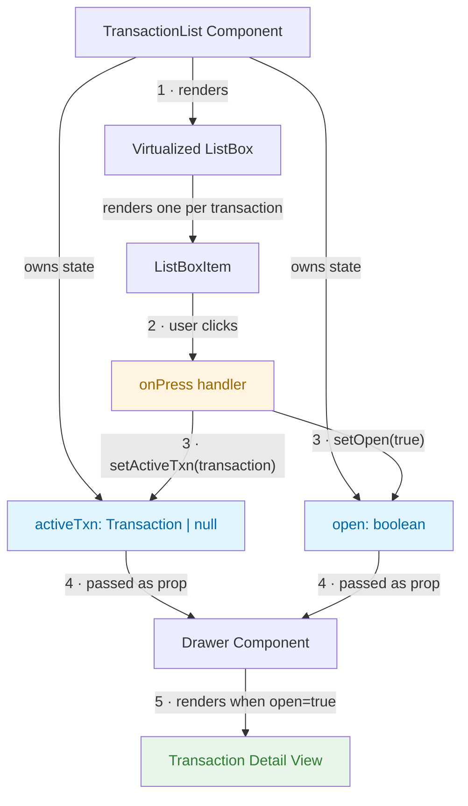

# Transaction List State Flow

# TransactionList

Renders a virtualized list of transactions. Clicking a row opens a Drawer with the transaction's details.

## How it works

State lives in `TransactionList` and is passed down as props:

| State       | Type         | Purpose                    |
| ----------- | ------------ | -------------------------- | ------------------------ |
| `activeTxn` | `Transaction | null`                      | The selected transaction |
| `open`      | `boolean`    | Controls drawer visibility |

When a list item is clicked, `onPress` sets both `activeTxn` (the full transaction object) and `open: true`. The Drawer reads these as props and renders the detail view.

## Why store the full transaction object?

Storing the full object instead of just an ID avoids an O(n) `.find()` lookup and handles pagination gracefully — the selected transaction stays available even if it scrolls out of the current page.

## Why props instead of context?

The API isn't finalized yet. Lifting state up and passing props keeps things simple and explicit — no `Drawer.Provider` wrapper, no context, no overengineering. Easy to refactor later once the API is settled.
