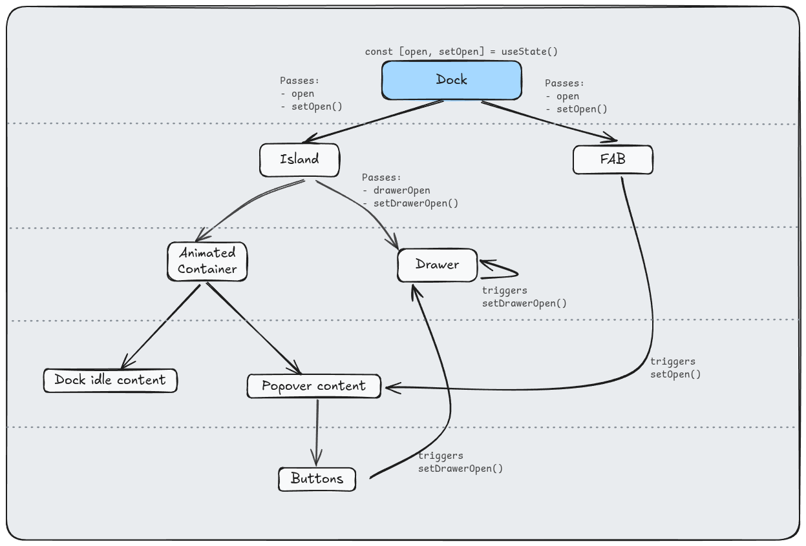

## Dependencies

This dock has 3 dependencies. Install them with your desired package manager.
Also don't forget to install `class-variance-authority` and `clsx` aswell (you
might already have it).

```sh
bun add motion react-use-measure @ark-ui/react react-aria-components
```

- [`react-use-measure`](https://www.npmjs.com/package/react-use-measure): to
  calculate the height of the children
- [`@ark-ui/react`](https://www.npmjs.com/package/@ark-ui/react): headless
  components
- [`react-aria-components`](https://www.npmjs.com/package/react-aria-components):
  For the buttons

- [`motion`](https://www.npmjs.com/package/motion): to animate stuff ofc!

## Component hierarchy:



## FAB (WIP)

- `src/components/app/dock/src/Fab.tsx` (old) will be replaced by `src/components/app/dock/src/FAB-v2.tsx` later.
- `FAB-v2.tsx` does not touch `Dock`/`Island`; it shows a popover to pick transaction type.
- Old `Fab.tsx` portals buttons into the island; the popover approach increased complexity and worsened DX.
