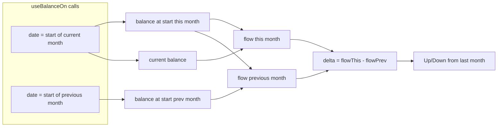

# Summary components

## Balance and month-over-month delta

The Balance component shows the user’s current total balance and a **month-over-month delta** (“from last month”). The delta answers: *how much more or less did the user gain (or lose) this month compared to last month?*

### How the delta is calculated

1. **Flow this month** = current balance − balance at start of this month  
2. **Flow previous month** = balance at start of this month − balance at start of previous month  
3. **Delta** = flow this month − flow previous month  

- **Positive delta**: user is up compared to last month (gained more or lost less).  
- **Negative delta**: user is down compared to last month (gained less or lost more).  

Balances and flows use the same sign convention (e.g. amounts in cents). The component uses `useBalanceOn` for the start of the current month and the start of the previous month to get the needed balances.

### Data flow

